# Screen-Based AI Communication Assistant

A full-stack, real-time speech-to-speech communication assistant designed for public-facing counters, interactive kiosks, healthcare desks, transport hubs, and face-to-face tablet interactions.

Zero custom hardware required. Runs natively on standard computers, tablets, and kiosks.

---

## 🏗 System Architecture

```mermaid
flowchart TD
    subgraph Browser ["Frontend (React 18 + Vite + Tailwind CSS)"]
        MIC["Microphone Audio"] --> WORKLET["Web Audio API Resampler (16kHz Mono PCM)"]
        WORKLET --> WS_CLIENT["WebSocket Client (Binary Audio & JSON)"]
        WS_CLIENT --> UI_PANELS["Dual Kiosk Panels (Person A & Person B)"]
        UI_PANELS --> FACE_MODE["180° Face-to-Face Counter Flip Mode"]
        UI_PANELS --> AUDIO_OUT["TTS Audio Player & Replay"]
    end

    subgraph Backend ["Backend (FastAPI + AsyncIO + WebSockets)"]
        WS_SERVER["WebSocket Server (/ws/stream)"]
        SESS["Session Manager (Bounded Queue & States)"]
        VAD["Voice Activity Detector (Energy & Boundary Segmenter)"]
        ASR["ASR Engine (Faster-Whisper int8 / Greedy Beam=1)"]
        TRANS["Multilingual Neural Translation Engine (Indian Native + Global)"]
        TTS["gTTS Neural Text-to-Speech Engine"]
        
        WS_SERVER <--> SESS
        SESS --> VAD
        VAD --> ASR
        ASR --> TRANS
        TRANS --> TTS
        TRANS --> WS_SERVER
        TTS --> WS_SERVER
    end
```



---

## 🎨 Theme & Visual Palette

Designed using the Warm Terracotta and Cream palette:
* **Warm Ivory**: `#F9F3CF`
* **Almond Cream**: `#EDE7CF`
* **Sand Gold**: `#DDBC89`
* **Terracotta Crimson**: `#AA512F`

---

## 📁 Repository Structure

```text
├── backend/
│   ├── app/
│   │   ├── main.py                     # FastAPI application & lifespan
│   │   ├── config.py                   # System configuration & domain vocabularies
│   │   ├── api/
│   │   │   └── websocket.py            # Real-time WebSocket streaming endpoint
│   │   ├── services/
│   │   │   ├── audio_processor.py      # PCM decoding, normalization, resampling
│   │   │   ├── vad_service.py          # Real-time Voice Activity Detection
│   │   │   ├── asr_service.py          # Faster-Whisper ASR inference & fallback
│   │   │   ├── translation_service.py  # Neural translation (Indian native & global)
│   │   │   └── tts_service.py          # Text-to-speech synthesis & caching
│   │   ├── session/
│   │   │   └── manager.py              # Bounded session states & memory guards
│   │   ├── models/
│   │   │   └── model_loader.py         # Singleton model preloader
│   │   └── schemas/
│   │       └── events.py               # Pydantic schemas for event protocol
│   ├── tests/
│   │   ├── test_api.py                 # Health & unit tests
│   │   └── test_websocket.py           # End-to-end WebSocket tests
│   ├── requirements.txt                # Python dependencies
│   └── .env.example
├── frontend/
│   ├── src/
│   │   ├── components/
│   │   │   ├── LanguageSelector.jsx    # Indian native & global language switcher
│   │   │   ├── AudioControls.jsx       # Mic controls, live VU meter & 180° flip
│   │   │   ├── TranscriptPanel.jsx     # Dual communication caption panels
│   │   │   ├── ConnectionStatus.jsx    # Real-time connection badge
│   │   │   └── LatencyIndicator.jsx    # Capture, VAD, ASR, translation metrics
│   │   ├── hooks/
│   │   │   ├── useAudioCapture.js      # 16kHz PCM downsampling Web Audio hook
│   │   │   └── useTranslationSocket.js # WebSocket event & session hook
│   │   ├── services/
│   │   │   └── websocket.js            # Resilient WebSocket transport client
│   │   ├── pages/
│   │   │   └── Translator.jsx          # Main split-screen countertop layout
│   │   ├── styles/
│   │   │   └── index.css               # Tailwind CSS & 180° counter rotation
│   │   ├── App.jsx
│   │   └── main.jsx
│   ├── package.json
│   ├── vite.config.js
│   ├── tailwind.config.js
│   └── .env.example
├── start.sh                            # One-click startup script
└── README.md
```

---

## ⚡ Quick Start

### 1. Prerequisites
- Python 3.10+
- Node.js 18+ and npm

### 2. Launch with Single Command
```bash
chmod +x start.sh
./start.sh
```

Or run manually:

**Backend:**
```bash
cd backend
python3 -m venv venv
source venv/bin/activate
pip install -r requirements.txt
uvicorn app.main:app --host 0.0.0.0 --port 8000 --reload
```

**Frontend:**
```bash
cd frontend
npm install
npm run dev
```

Visit:
- **Frontend App**: `http://localhost:3000`
- **Backend Swagger Docs**: `http://localhost:8000/docs`
- **Health Check**: `http://localhost:8000/health`

---

## 🇮🇳 Supported Native Indian & Global Languages

| Language | Script / Code | Native Name | Region |
| :--- | :--- | :--- | :--- |
| **Hindi** | `hi` | हिन्दी | India |
| **Punjabi** | `pa` | ਪੰਜਾਬੀ | India |
| **Bengali** | `bn` | বাংলা | India |
| **Tamil** | `ta` | தமிழ் | India |
| **Telugu** | `te` | తెలుగు | India |
| **Marathi** | `mr` | मराठी | India |
| **Gujarati** | `gu` | ગુજરાતી | India |
| **Urdu** | `ur` | اردو | India |
| **English** | `en` | English | Global |
| **Spanish** | `es` | Español | Global |
| **French** | `fr` | Français | Global |
| **German** | `de` | Deutsch | Global |
| **Arabic** | `ar` | العربية | Global |
| **Japanese** | `ja` | 日本語 | Global |

---

## 📡 WebSocket Event Protocol

### 1. Connection Ready (Server → Client)
```json
{
  "type": "ready",
  "session_id": "8b51c3e1-382a-4bc4-9d74-...",
  "source_language": "hi",
  "target_language": "en",
  "speaker_role": "person_a",
  "sample_rate": 16000
}
```

### 2. Start Session (Client → Server)
```json
{
  "type": "start",
  "source_language": "hi",
  "target_language": "en",
  "speaker_role": "person_a",
  "audio_format": "pcm_s16le",
  "sample_rate": 16000,
  "domain": "railway"
}
```

### 3. Binary Audio Frames (Client → Server)
- 16,000 Hz, 16-bit Mono Little-Endian PCM raw bytes streamed continuously over the WebSocket.

### 4. Translation Result (Server → Client)
```json
{
  "type": "translation",
  "session_id": "8b51c3e1-...",
  "segment_id": 1,
  "speaker_role": "person_a",
  "source_language": "hi",
  "target_language": "en",
  "source_text": "मुझे टिकट रद्द करानी है",
  "translated_text": "I need to cancel my ticket",
  "is_final": true,
  "latency": {
    "capture_ms": 110,
    "vad_ms": 20,
    "asr_ms": 160,
    "translation_ms": 85,
    "total_ms": 375
  },
  "audio_data_base64": "<base64-encoded-mp3>"
}
```

---

## 🔒 Privacy & Security
- **Zero raw audio storage**: Audio frames processed in volatile memory only and discarded.
- **Bounded Queues**: Audio buffers strictly capped at 500 frames to prevent memory leaks.
- **Local / Self-hosted execution**: Supports local Faster-Whisper models for offline privacy.

---

## 🧪 Running Tests
```bash
PYTHONPATH=backend ./backend/venv/bin/pytest -c backend/pytest.ini backend/tests/
```
